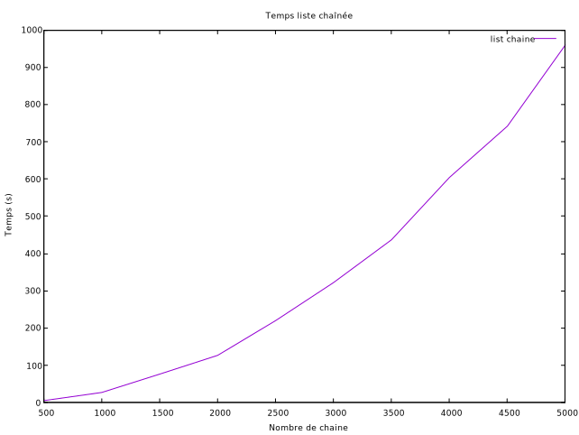
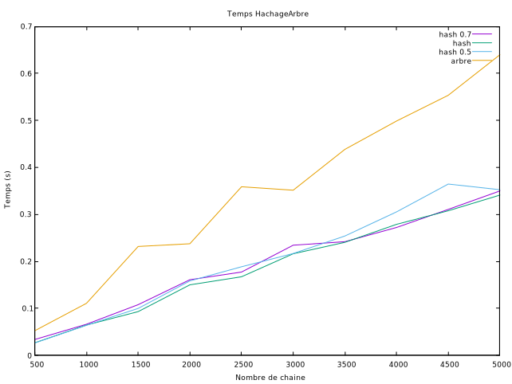

# **Rapport Projet : Réorganisation d'un réseau de fibres optiques**

## **Comparaison des trois structure**

Les trois structures sont la liste chaînée, la table de hachage et l'arbre quaternaire.
Rappel des paramètres à prendre en compte : Une chaîne est crée aléatoirement pour tester la reconstitution du réseau selon la structure. Une chaine est composée d'un ensemble de chaînes constitué de 100 points (dont les coordonnées (x,y) sont généré aléatoirement entre 0 et 5000) par chaîne.

### **Liste chaînée**

Ce graphe nous révèle donc bien que la liste chaînée avec une quantité de données très volumineuse est beaucoup trop coûteuse en temps. Plus le nombre de chaîne augmente, et plus la reconstitution du réseau est conséquente en temps.
De plus, étant donné sa faible complexité, les données ne sont pas triées, ce qui rend la recherche d'autant plus longue.
Pour notre part, la reconstitution nous a pris entre 15 à 20 minutes pour 5000 chaînes.

### **Table de hachage et Arbre quaternaire**

L'arbre quaternaire, est donc une structure performante car il offre un accès aux "gammes d'éléments" beaucoup plus instantané. Avec une complexité moyenne, les recherches et insertions sont en O(log n), et la reconstitution se fait en 600 ms pour 5000 chaînes.

La table de hachage, peu importe sa taille, nous offre des résultats beaucoup plus concluants par rapport aux listes chaînées et est une autre solution potentielle par rapport aux arbres, car elle offre un accès aux éléments plus rapide, les recherches et insertions sont en O(1) en moyenne. Malgré sa grande complexité, la reconstitution du réseau dure environs 300 ms pour 5000 chaînes.

