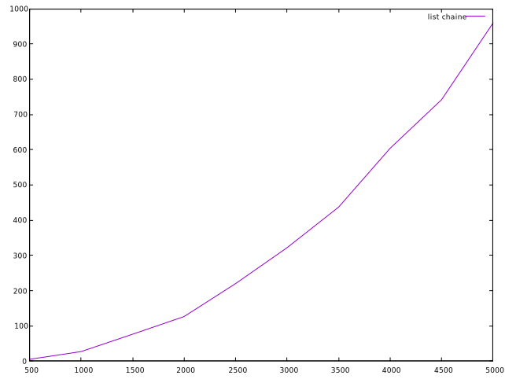

# **Rapport Projet : Réorganisation d'un réseau de fibres optiques**

## **Comparaison des trois structure**

Les trois structures sont la liste chaînée, la table de hachage et l'arbre quartenaire.
Rappel des paramètres à prendre en compte : Une chaîne est crée aléatoirement pour tester la reconstitution du réseau selon la structure. Une chaine est composée d'un ensemble de chaînes constitué de 100 points (dont les coordonnées (x,y) sont généré aléatoirement entre 0 et 5000) par chaîne.

### **La liste chaînée**

